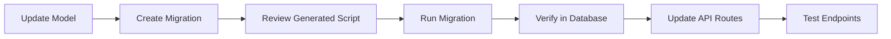

# 🗃️ Alembic Database Migration Guide

> A complete guide to managing database migrations with Alembic & SQLAlchemy

---

## 📋 Table of Contents

- [🚧 Creating Migrations](#-creating-migrations)
- [🚀 Running & Managing Migrations](#-running--managing-migrations)
- [🧪 Verification](#-verification)
- [🧱 Model Updates](#-model-updates)
- [🌐 API Integration](#-api-integration)
- [🎯 Quick Reference](#-quick-reference)

---

## 🚧 Creating Migrations

### Generate New Migration

```bash
alembic revision --autogenerate -m "Update phone column in buyers"
```

**✅ What this does:**

- Compares your models with current database schema
- Auto-generates migration scripts
- Creates a new revision file

---

## 🚀 Running & Managing Migrations

### 🔼 Apply Specific Migration

Apply a particular migration by its revision hash:

```bash
alembic upgrade <revision_hash>
```

**Example:**

```bash
alembic upgrade abshs22455
```

### 🔽 Rollback to Previous Version

Downgrade to a previous migration:

```bash
alembic downgrade <revision_hash>
```

**Example:**

```bash
alembic downgrade dgavhsbj1234
```

### 🆙 Upgrade to Latest

Bring database to the most recent state:

```bash
alembic upgrade head
```

**📌 Pro Tip:** Always run this command after pulling latest code changes!

---

## 🧪 Verification

### Connect to PostgreSQL

```bash
psql -U django -d myntra
```

**🔐 Credentials:**

- Username: `django`
- Password: `Django@123`
- Database: `myntra`

### Verify Changes

Once connected, run these SQL commands:

#### Check Table Structure

```sql
\d buyers;
```

#### View Table Data

```sql
SELECT * FROM buyers;
```

#### List All Tables

```sql
\dt
```

#### Check Migration History

```sql
SELECT * FROM alembic_version;
```

---

## 🧱 Model Updates

### Before Migration: Update Your Models

Make sure your SQLAlchemy models reflect the desired changes:

```python
# models/buyer.py
from sqlalchemy import Column, String, Integer

class Buyer(Base):
    __tablename__ = 'buyers'

    id = Column(Integer, primary_key=True)
    username = Column(String(50), unique=True, nullable=False)
    phone = Column(String(25), unique=True, nullable=True)  # ← Updated field
    email = Column(String(100), unique=True, nullable=False)
```

### After Migration: Verify Model Sync

```python
# Verify your model matches the database
from sqlalchemy import inspect
inspector = inspect(engine)
columns = inspector.get_columns('buyers')
print([col['name'] for col in columns])
```

---

## 🌐 API Integration

### Using Updated Fields in Routes

After successful migration, update your API endpoints:

```python
from flask import Blueprint, jsonify
from models.buyer import Buyer
from database import get_session

buyer_bp = Blueprint('buyers', __name__)

@buyer_bp.route('/<int:buyer_id>', methods=['GET'])
def get_buyer(buyer_id):
    session = get_session()
    try:
        buyer = session.query(Buyer).filter_by(id=buyer_id).first()

        if not buyer:
            return jsonify({"error": "Buyer not found"}), 404

        return jsonify({
            "id": buyer.id,
            "username": buyer.username,
            "phone": buyer.phone,  # ← Now available after migration
            "email": buyer.email
        }), 200

    except Exception as e:
        return jsonify({"error": str(e)}), 500
    finally:
        session.close()
```

---

## 🎯 Quick Reference

### Common Commands Cheatsheet

| Action                    | Command                                        |
| ------------------------- | ---------------------------------------------- |
| 🆕 Create migration       | `alembic revision --autogenerate -m "message"` |
| 🚀 Upgrade to latest      | `alembic upgrade head`                         |
| ⬆️ Upgrade to specific    | `alembic upgrade <revision>`                   |
| ⬇️ Downgrade to specific  | `alembic downgrade <revision>`                 |
| 📋 Show current revision  | `alembic current`                              |
| 📜 Show migration history | `alembic history`                              |
| 🧪 Connect to PostgreSQL  | `psql -U django -d myntra`                     |

### Migration Workflow



---

## ⚠️ Best Practices

### ✅ Do's

- Always review auto-generated migrations before running
- Test migrations on development database first
- Keep migration messages descriptive
- Backup database before major migrations
- Run migrations in staging before production

### ❌ Don'ts

- Don't edit migration files after they've been applied
- Don't skip migration steps
- Don't run migrations directly on production without testing
- Don't delete migration files once they're committed

---

## 🔧 Troubleshooting

### Common Issues & Solutions

**Issue:** Migration conflicts

```bash
# Solution: Merge migration heads
alembic merge heads -m "merge migrations"
```

**Issue:** Migration out of sync

```bash
# Solution: Stamp current state
alembic stamp head
```

**Issue:** Rollback failed migration

```bash
# Solution: Check history and downgrade step by step
alembic history --verbose
alembic downgrade -1
```

---

## 🎉 You're All Set!

Your database migration workflow is now streamlined! You can:

- ✅ Create migrations with confidence
- 🔄 Manage database versions effectively
- 💾 Keep schemas perfectly synchronized
- 🧪 Integrate seamlessly with your APIs
- 🚀 Deploy with zero downtime

---

### 💡 Need Help?

- 📖 [Alembic Documentation](https://alembic.sqlalchemy.org/)
- 🐍 [SQLAlchemy Docs](https://docs.sqlalchemy.org/)
- 🆘 [Common Migration Patterns](https://alembic.sqlalchemy.org/en/latest/cookbook.html)

---

**Happy coding! 🚀 Keep building amazing things!**
